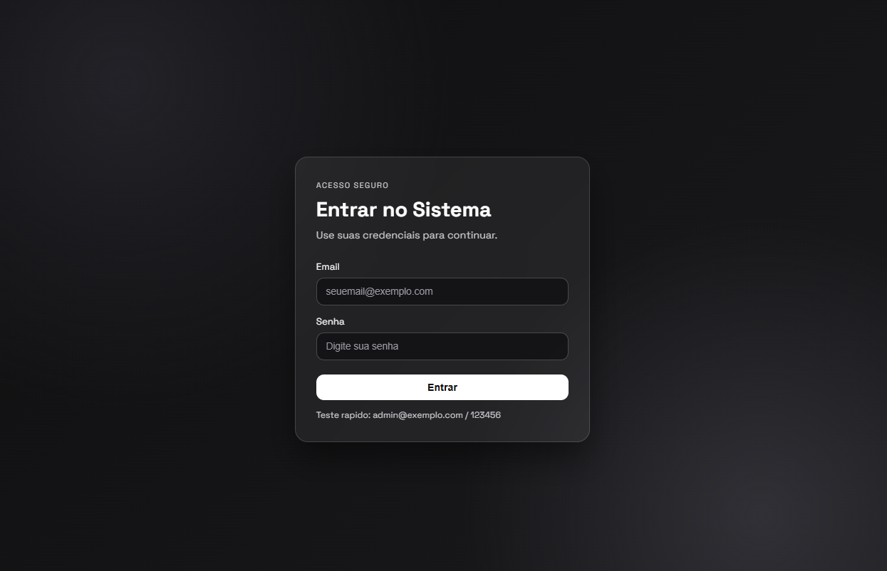
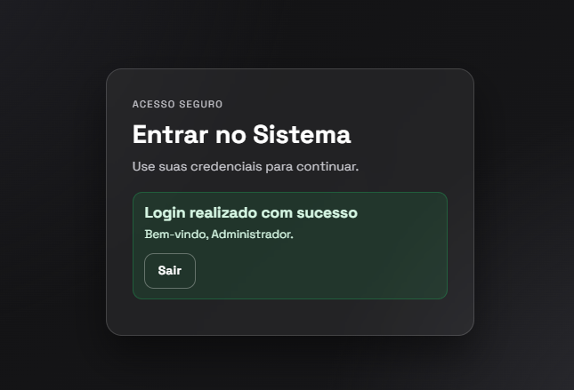

# Login Upgrade Sistema de Autenticação

## 📖 Sobre o projeto

O **LoginUpgrade** é um sistema de autenticação desenvolvido em PHP, com uma interface responsiva construída em HTML5 e CSS3. O projeto utiliza sessões nativas do PHP e foi criado para fins de estudo e demonstração técnica.

Seu principal objetivo é demonstrar a implementação de um fluxo de login local com controles de segurança aplicados no servidor. A solução contempla autenticação, manutenção da sessão e encerramento seguro do acesso, sem depender de frameworks.

O diferencial técnico do projeto está na proteção do fluxo de autenticação contra riscos comuns, como falsificação de requisições, fixação de sessão, tentativas repetidas de acesso e exibição insegura de dados.

## ✨ Funcionalidades

### Fluxo de autenticação

- Tela de login responsiva;
- campos para e-mail e senha;
- validação das credenciais no servidor;
- criação e manutenção de uma sessão autenticada;
- logout seguro;
- feedback visual para sucesso ou erro de autenticação.

### Controles de segurança

- **Proteção CSRF:** os formulários utilizam token CSRF para validar a origem das requisições;
- **proteção contra fixação de sessão:** o ID da sessão é regenerado após a autenticação com `session_regenerate_id`;
- **cookies de sessão protegidos:** utilização das opções `HttpOnly` e `SameSite=Strict`;
- **validação de e-mail:** o formato do endereço informado é verificado no backend;
- **verificação segura da senha:** a credencial é validada com `password_verify`;
- **limitação de tentativas:** acessos inválidos repetidos provocam bloqueio temporário;
- **escape de saída:** valores exibidos na página são tratados com `htmlspecialchars`.

Essas medidas atuam em conjunto para reforçar a integridade da sessão e reduzir a exposição do fluxo de login a ataques comuns em aplicações web.

## 🖼️ Screenshots

### Tela de login



### Autenticação realizada



## 🚀 Tecnologias

- **PHP:** processamento das credenciais, sessões e controles de segurança;
- **sessões nativas do PHP:** manutenção do estado autenticado;
- **HTML5:** estrutura semântica das páginas;
- **CSS3:** estilização e responsividade da interface.

## ⚙️ Como executar

### Pré-requisitos

- PHP instalado e disponível no terminal;
- navegador web moderno.

O projeto não exige instalação de dependências.

### Iniciar o servidor local

No terminal, acesse a pasta do projeto e inicie o servidor embutido do PHP:

```bash
php -S localhost:8001
```

### Acessar a aplicação

Com o servidor em execução, abra o seguinte endereço no navegador:

```text
http://localhost:8001
```

### Credenciais de demonstração

Utilize as credenciais abaixo para testar o fluxo de autenticação:

```text
E-mail: admin@exemplo.com
Senha: 123456
```

> As credenciais são destinadas exclusivamente à demonstração local do projeto.

## 📂 Estrutura do projeto

O projeto mantém a lógica da aplicação, os estilos e as imagens de documentação em uma estrutura compacta:

```text
.
├── index.php
├── style.css
├── Login.PNG
├── Loginrealizado.PNG
└── README.md
```

- `index.php`: fluxo de autenticação, sessão e interface da aplicação;
- `style.css`: estilos e regras de responsividade;
- `Login.PNG`: screenshot da tela de login;
- `Loginrealizado.PNG`: screenshot da autenticação concluída;
- `README.md`: documentação técnica do projeto

## 🌐 Deploy

O LoginUpgrade é uma aplicação PHP tradicional e pode ser hospedado em qualquer servidor web compatível com PHP.

Para execução local, podem ser utilizados XAMPP, Laragon, WAMP ou o servidor embutido do PHP. Em uma hospedagem remota, os arquivos devem ser enviados ao diretório público do servidor e o ambiente precisa oferecer uma versão compatível do PHP.

Como a versão atual utiliza autenticação local para demonstração, qualquer adaptação para uso real deve substituir as credenciais de exemplo e considerar persistência segura, configuração HTTPS e gerenciamento adequado de segredos.

## 👤 Autor

**Natan Da Luz**

- LinkedIn: [linkedin.com/in/natandaluz](https://www.linkedin.com/in/natandaluz/)
- Portfólio: [portfolionatan.vercel.app](https://portfolionatan.vercel.app/)
- E-mail: [natandaluz01@gmail.com](mailto:natandaluz01@gmail.com)

## 📄 Licença

Este projeto está sem uma licença definida no momento.
